Genomic evidence that biodiversity can help optimize the quantity and quality of algal biomass for biocrude
================
Sara L. Jackrel, Anita Narwani, Bastian Bentlage, Bobbi Levine, David C. Hietala, Phillip E. Savage, Todd H. Oakley, Vincent J. Denef, Bradley J. Cardinale
September 1, 2017

Main Text Analyses
------------------

Fig. 1. Bicultures outperform monocultures by more closely approaching optimal production of both high biocrude quantity and quality (nested linear model on euclidean distance to optimum: F1,34 = 2.9, p &lt; 0.01). As illustrated with the multifunctionality threshold approach, 43% of bicultures versus 25% of monocultures fall within the upper quadrant indicating higher than average biocrude quantity, via biomass, as well as quality, via FAME percentage of biomass. Species identities are: (1) Chlorella sorokiniana, (2) Closteriopsis acicularis, (3) Cosmarium turpinii, (4) Pandorina charkowiensis, (5) Scenedesmus acuminatus, (6) Selenastrum capricornutum, (7) Staurastrum punctulatum, and (8) Tetraedron minutum.

``` r
rm(list = ls())
library(nlme)
library(ggplot2)

Biomass.FAME<-read.csv("C:/Users/Sara/Desktop/Biofuels Genomics Github/Total FAME x Biovolume.csv")
Biomass.FAME<-data.frame(Biomass.FAME$Euclidean.Distance,Biomass.FAME$DE.Lipids,Biomass.FAME$Total.Culture.Biomass.RANKED,Biomass.FAME$FAME.wt....RANKED,Biomass.FAME$Mono.v.Bi,Biomass.FAME$Treatment)

Biomass.FAME<-Biomass.FAME[!is.na(Biomass.FAME$Biomass.FAME.Total.Culture.Biomass.RANKED),]
Threshold.Approach.Multifunctionality<-read.csv("C:/Users/Sara/Desktop/Biofuels Genomics Github/multifunctionality.csv")
Threshold.Approach.Multifunctionality<-data.frame(Threshold.Approach.Multifunctionality$Euclidean.Distance.All, Threshold.Approach.Multifunctionality$Combo,Threshold.Approach.Multifunctionality$Mono.v.Bi)
Threshold.Approach.Multifunctionality<-Threshold.Approach.Multifunctionality[!is.na(Threshold.Approach.Multifunctionality$Threshold.Approach.Multifunctionality.Euclidean.Distance.All),]

Threshold.Approach.Multifunctionality$Threshold.Approach.Multifunctionality.Combo<-as.factor(Threshold.Approach.Multifunctionality$Threshold.Approach.Multifunctionality.Combo)
stats <- lm(Threshold.Approach.Multifunctionality.Euclidean.Distance.All~Threshold.Approach.Multifunctionality.Mono.v.Bi/Threshold.Approach.Multifunctionality.Combo,data=Threshold.Approach.Multifunctionality)

p<-ggplot(Biomass.FAME,aes(Biomass.FAME.Total.Culture.Biomass.RANKED,Biomass.FAME.FAME.wt....RANKED,colour=Biomass.FAME.Mono.v.Bi,label=Biomass.FAME.Treatment))+
  geom_point(aes(size =3))+
  geom_text(aes(label=Biomass.FAME.Treatment),hjust=0.5,vjust=1.6)+
  theme(legend.text.align = 0,legend.key=element_rect(fill=NA),panel.grid.major = element_blank(), panel.grid.minor = element_blank(),panel.background = element_blank(), axis.line = element_line(colour = "black"),axis.text=element_text(size = 16),axis.title=element_text(size=18,face="plain"),legend.title=element_text(size=16),legend.text=element_text(size=16))+
  scale_colour_manual(values=c("black","grey","blue"),name="Culture",labels=c("Monoculture","Biculture","Optimum"),guide='none')+
  xlab("Biocrude Quantity \n (rank ordered biomass yield)")+
  ylab("Biocrude Quality \n (rank ordered FAME wt% of sample)")+
  scale_size(guide="none")+
  geom_vline(xintercept = 0.5,linetype=2)+
  geom_hline(yintercept = 0.5,linetype=2)
p
```

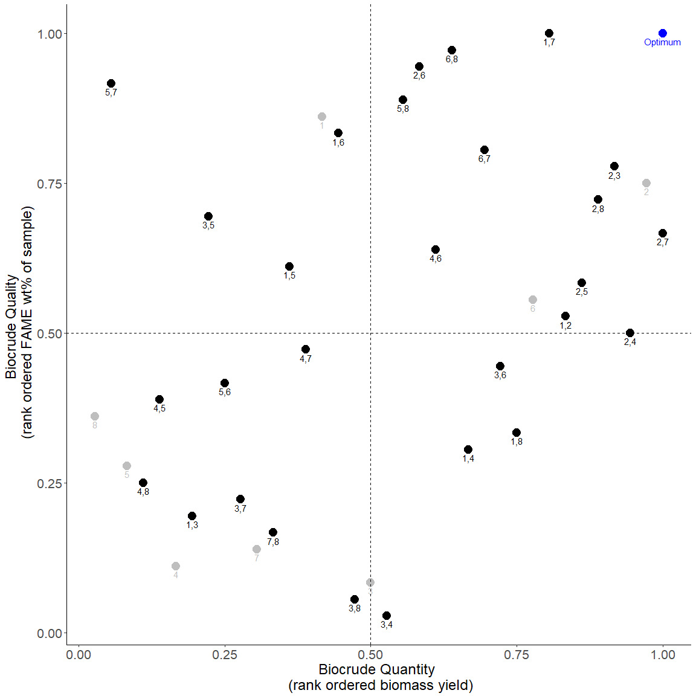

Fig. 2. Significant differential lipid gene expression was observed only in communities overyielding in FAME and/or biomass. Solid lines connect populations growing together in biculture, symbol shape indicates whether biculture populations are above or below the biomass that species produced in monoculture, and symbol fill indicates whether that biculture is overyielding in FAME. Location on the x-axis indicates whether those populations significantly differentially express lipid genes via Kolmogrov-Smirnov tests on the distributions of log2 fold change values of lipid versus non-lipid genes. Relative FAME yield was calculated as: mean FAME yield of A + B biculture/(mean(mean yield of species A in monoculture and mean yield of species B in monoculture)). Missing symbol pairs are for those populations with insufficient gene library sizes for inclusion in transcriptome analyses. Note that half of those populations differentially expressing lipid genes maintained biomass above levels attained in monoculture. Further, among the top ten bicultures with the highest relative FAME yield, six bicultures have one or both species differentially regulating lipid genes. The only two bicultures showing differential expression of lipid genes that did not overyield in FAME, overyielded in biomass.

``` r
rm(list = ls())
library(ggplot2)

competition.figure<-read.csv("C:/Users/Sara/Desktop/Biofuels Genomics Github/Competition.figure.csv")

ggplot(competition.figure,aes(Simple.Sig.NS,Ranked.Combined.Relative.FAME.log2FC))+
  geom_rect(fill = "light gray", alpha = 0.15,aes(xmin=0.05,xmax=1.0,ymin=-5,ymax=35))+
  geom_point(aes(shape=Overyielding.FAME,size=3,stroke=1.5,fill=Shapes))+
  geom_line(aes(group = combo))+
  guides(fill=FALSE)+
  xlab("Differential Expression of Lipid Genes")+
  ylab("Ranked Relative FAME Yield")+
  theme(axis.text.x=element_blank(),axis.ticks.x=element_blank(),legend.text.align = 0,legend.title.align=0.5,legend.key=element_rect(fill=NA),panel.grid.major = element_blank(), panel.grid.minor = element_blank(),panel.background = element_blank(), axis.line = element_line(colour = "black"),axis.text=element_text(size = 12),axis.title=element_text(size=14,face="plain"),legend.title=element_blank(),legend.text=element_text(size=14))+
  scale_shape_manual(values=c("No"=22,"Yes"=21),guide="none")+
  scale_fill_manual(values=c("UnderYes"="white","UnderNo"="white","OverYes"="black","OverNo"="black"),labels=c("OverYes"= "\n Biomass Above (FAME Overyielding) \n","UnderYes"="\n Biomass Below (FAME Overyielding) \n","OverNo"="\n Biomass Above (Not FAME Overyielding) \n","UnderNo" = "\n Biomass Below (Not FAME Overyielding) \n"))+
  scale_size(range = c(1,5),guide="none")+
  coord_cartesian(xlim=c(-0.02,0.12), ylim=c(0.00,28))+
  annotate ("text", x = 0.01, y = 0.02, label = "No DE",size=5)+
  annotate("text",x=0.09,y=0.02, label = "Significant DE",size=5)
```

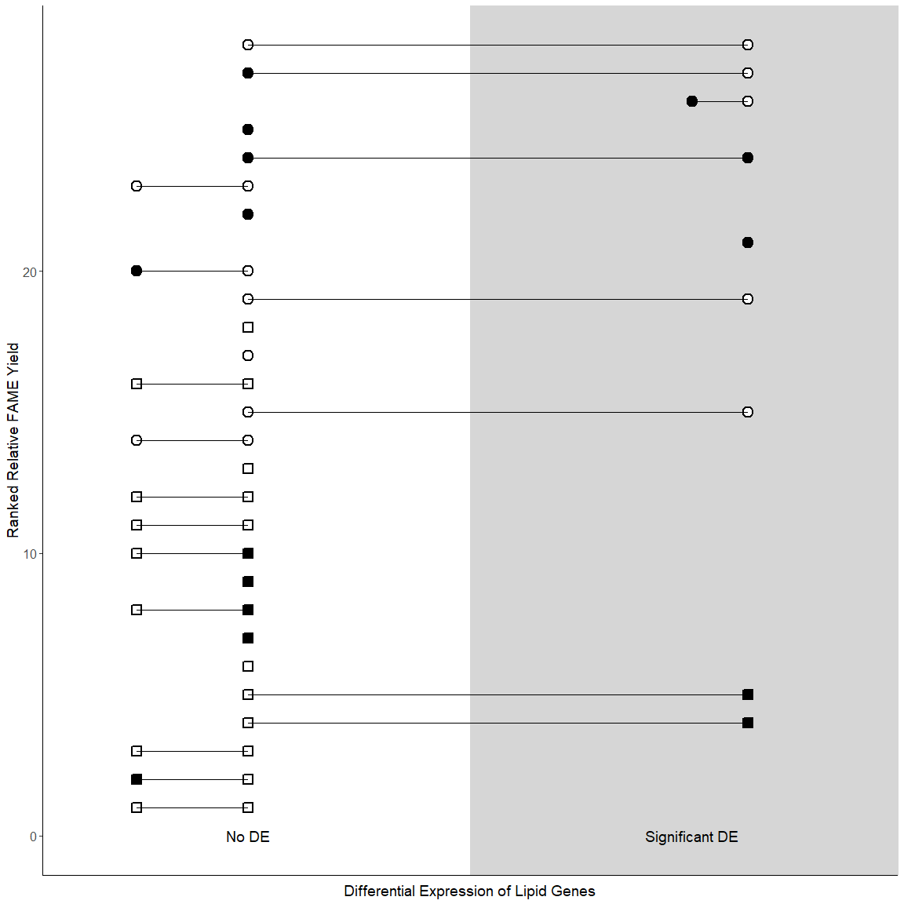

Fig. 3. Bicultures overyielding versus non-overyielding in FAME production exhibit notably distinct expression patterns of genes regulating synthesis and oxidation of fatty acids and other lipids. These patterns are conserved across multiple algal species. We illustrate these patterns via principal component analysis incorporating mean log2 fold change values in the monoculture versus biculture condition for each algal species of 28 different Gene Ontology groups involved in lipid regulatory functions.

``` r
rm(list = ls())
library(ggplot2)
library(dplyr)
Aggregated.Go.Tables<-read.csv("C:/Users/Sara/Desktop/Biofuels Genomics Github/pca.csv",header=TRUE)          
Aggregated.Go.Tables <- Aggregated.Go.Tables %>% mutate(FAME.Overyielding.2 = if_else(Biculture %in% c("logFC68","logFC86","logFC17","logFC71","logFC85","logFC58","logFC57","logFC75","logFC26","logFC62","logFC23","logFC32","logFC46","logFC64","logFC67","logFC76","logFC35","logFC53","logFC24","logFC42","logFC36","logFC63","logFC47","logFC74","logFC45","logFC54"), "Yes", "No"))
Aggregated.Go.Tables <- Aggregated.Go.Tables %>% mutate(Species = if_else(Biculture %in% c("logFC12","logFC13","logFC14","logFC15","logFC16","logFC17","logFC18"), "1",if_else(Biculture %in% c("logFC21","logFC23","logFC24","logFC25","logFC26","logFC27","logFC28"), "2",if_else(Biculture %in% c("logFC31","logFC32","logFC34","logFC35","logFC36","logFC37","logFC38"), "3",if_else(Biculture %in% c("logFC42","logFC43","logFC46","logFC47"), "4",if_else(Biculture %in% c("logFC51","logFC52","logFC53","logFC54","logFC56","logFC57","logFC58"), "5",if_else(Biculture %in% c ("logFC61","logFC62","logFC64","logFC67","logFC68"), "6",if_else(Biculture %in% c("logFC71","logFC72","logFC74","logFC75","logFC76","logFC78"), "7",if_else(Biculture %in% c("logFC81","logFC82","logFC83","logFC84","logFC86","logFC87"), "8","0")))))))))

Aggregated.Go.Tables <- Aggregated.Go.Tables %>% mutate(FAME.T.Overyielding = if_else(Biculture %in% c("logFC68","logFC17","logFC71","logFC58","logFC57","logFC75","logFC26","logFC62","logFC23","logFC32","logFC46","logFC64","logFC67","logFC76","logFC35","logFC53","logFC47","logFC74","logFC45","logFC54"), "Yes", "No"))
data<-Aggregated.Go.Tables[,1:29]
labels<-c(12,13,14,15,16,17,18,21,23,24,25,26,27,28,31,32,34,36,37,38,42,46,47,51,52,53,54,56,57,58,61,62,64,67,68,71,72,74,75,76,78,81,82,83,84,86,87)
row.names(data)<-labels
data$Biculture<-NULL
new.pca <- prcomp(data,center = TRUE)
Aggregated.Go.Tables$Species<-as.factor(Aggregated.Go.Tables$Species)
PC13<-new.pca$x[,1:3]
PC23<-new.pca$x[,2:3]
PC14<-new.pca$x[,1:4]
PC3<-new.pca$x[,3]
PC2<-new.pca$x[,2]
PC1<-new.pca$x[,1]

result<-manova(cbind(PC1,PC2,PC3)~Aggregated.Go.Tables$FAME.Overyielding+Aggregated.Go.Tables$Species)
result<-aov(PC1~Aggregated.Go.Tables$FAME.Overyielding.2+Aggregated.Go.Tables$Species)
result<-aov(PC2~Aggregated.Go.Tables$FAME.Overyielding.2+Aggregated.Go.Tables$Species)
result<-aov(PC3~Aggregated.Go.Tables$FAME.Overyielding.2+Aggregated.Go.Tables$Species)

Aggregated.Go.Tables <- Aggregated.Go.Tables %>% mutate(FAME.Overyielding.3 = if_else(FAME.Overyielding.2 %in% c("Yes"), "1", "0"))
Aggregated.Go.Tables$FAME.Overyielding.3<-as.numeric(Aggregated.Go.Tables$FAME.Overyielding.3)

result<-glm(Aggregated.Go.Tables$FAME.Overyielding.3~PC1+PC2+PC3,family=binomial(link="logit"))
reduced<-glm(Aggregated.Go.Tables$FAME.Overyielding.3~PC2+PC3,family=binomial(link="logit"))
single<-glm(Aggregated.Go.Tables$FAME.Overyielding.3~PC2,family=binomial(link="logit"))
null<-glm(Aggregated.Go.Tables$FAME.Overyielding.3~1,family=binomial(link="logit"))
anova(null,reduced,test="Chisq")
```

    ## Analysis of Deviance Table
    ## 
    ## Model 1: Aggregated.Go.Tables$FAME.Overyielding.3 ~ 1
    ## Model 2: Aggregated.Go.Tables$FAME.Overyielding.3 ~ PC2 + PC3
    ##   Resid. Df Resid. Dev Df Deviance Pr(>Chi)   
    ## 1        46     64.964                        
    ## 2        44     54.231  2   10.733 0.004671 **
    ## ---
    ## Signif. codes:  0 '***' 0.001 '**' 0.01 '*' 0.05 '.' 0.1 ' ' 1

``` r
anova(single,null,test="Chisq")
```

    ## Analysis of Deviance Table
    ## 
    ## Model 1: Aggregated.Go.Tables$FAME.Overyielding.3 ~ PC2
    ## Model 2: Aggregated.Go.Tables$FAME.Overyielding.3 ~ 1
    ##   Resid. Df Resid. Dev Df Deviance Pr(>Chi)   
    ## 1        45     55.585                        
    ## 2        46     64.964 -1  -9.3792 0.002195 **
    ## ---
    ## Signif. codes:  0 '***' 0.001 '**' 0.01 '*' 0.05 '.' 0.1 ' ' 1

``` r
my_expression<-expression(paste(italic("Chlorella sorokiniana")))
my_expression1<-expression(paste(italic("Closteriopsis acicularis")))
my_expression2<-expression(paste(italic("Cosmarium turpinii")))
my_expression3<-expression(paste(italic("Pandorina charkowiensis")))
my_expression4<-expression(paste(italic("Scenedesmus acuminatus")))
my_expression5<-expression(paste(italic("Selenastrum capricornutum")))
my_expression6<-expression(paste(italic("Staurastrum punctulatum")))
my_expression7<-expression(paste(italic("Tetraedron minimum")))
Yes<-data.frame(PC2=0.02422156,PC3=-0.1920427)
No<-data.frame(PC2=-0.02131497,PC3=0.1689975)
data<-cbind(new.pca$x,Aggregated.Go.Tables[,30:32],Aggregated.Go.Tables[,1])
data$Species<-as.factor(data$Species)


ggplot(data, aes(PC2,PC3,colour=data$Species,shape=data$FAME.Overyielding,size=3))+
  geom_point()+
  theme(legend.text.align = 0,legend.title.align=0.5,legend.key=element_rect(fill=NA),panel.grid.major = element_blank(), panel.grid.minor = element_blank(),panel.background = element_blank(), axis.line = element_line(colour = "black"),axis.text=element_text(size = 12),axis.title=element_text(size=14,face="plain"),legend.title=element_text(size=14),legend.text=element_text(size=14))+
  guides(color=guide_legend(override.aes=list(size=5)),shape=guide_legend(override.aes=list(size=5)))+
  scale_shape_manual("FAME Overyielding",labels=c("Not Overyielding", "Overyielding"),values=c(16,7))+
  scale_colour_manual("Species",labels=c(my_expression,my_expression1,my_expression2,my_expression3,my_expression4,my_expression5,my_expression6,my_expression7),values=c("red","orange","springgreen3","blue","purple","black","gray","chocolate4"))+
  scale_size(guide="none")+
  xlab("PC2   (16.1% of Variance)")+
  ylab ("PC3   (7.7% of Variance)")
```

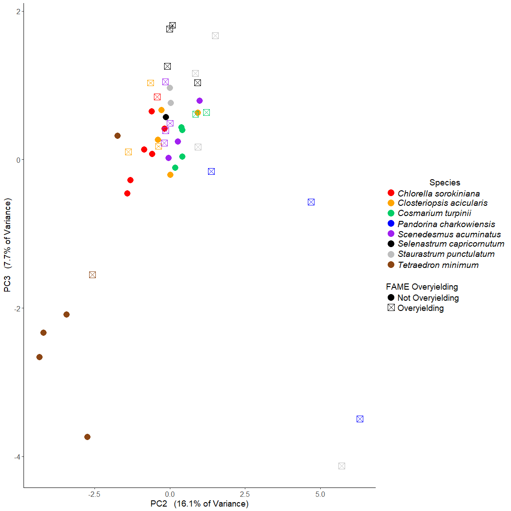

Supplementary Figures
---------------------

Section 1: Multifunctionality metrics indicate bicultures significantly outperform monocultures.
================================================================================================

Fig S1. There are several approaches for calculating multifunctionality. (a) Here, we show that a higher percentage of bicultures versus monocultures simultaneously exceed thresholds for quality and quantity metrics. (b) Additionally, we find that bicultures outperform monocultures via the averaging multifunctionality metric. We calculated this averaging multifunctionality index where FAME (wt % of samples) and Biomass (i.e., log transformed values of population cell density multiplied by estimates of cell biovolume) values were standardized via conversion to z-scores, and the FAME and Biomass standard scores were then averaged together to yield a multifunctionality value. Averaged multifunctionality index values across biological replicates are shown. Note the nested ANOVA uses all biological replicates with species combination nested within species richness.

``` r
rm(list = ls())
library(ggplot2)

Threshold.Approach.Multifunctionality<-read.csv("C:/Users/Sara/Desktop/Biofuels Genomics Github/multifunctionality.csv")
data<-data.frame(Threshold.Approach.Multifunctionality$Threshold,Threshold.Approach.Multifunctionality$Culture,Threshold.Approach.Multifunctionality$Percent.Cultures.Above.Threshold)
ggplot(data,aes(Threshold.Approach.Multifunctionality.Threshold,Threshold.Approach.Multifunctionality.Percent.Cultures.Above.Threshold,colour=Threshold.Approach.Multifunctionality.Culture))+
  geom_line()+
  theme(legend.text.align = 0,legend.key=element_rect(fill=NA),panel.grid.major = element_blank(), panel.grid.minor = element_blank(),panel.background = element_blank(), axis.line = element_line(colour = "black"),axis.text=element_text(size = 16),axis.title=element_text(size=18,face="plain"),legend.title=element_text(size=16),legend.text=element_text(size=16))+
  scale_colour_manual(values=c(Monoculture="grey",Biculture="black"),name="Culture")+
  xlab("Threshold \n(minimum preformance rank for both functions)")+
  ylab("Percent of Composition > Threshold")
```

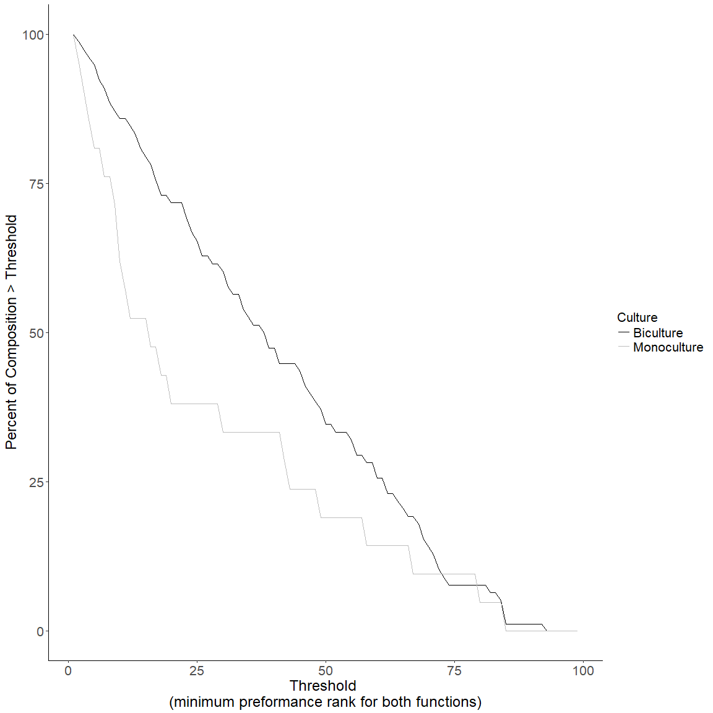

``` r
Biomass.FAME<-read.csv("C:/Users/Sara/Desktop/Biofuels Genomics Github/Total FAME x Biovolume.csv")
Biomass.FAME<-data.frame(Biomass.FAME$Treatment.1,Biomass.FAME$Avg.Multifunctionality,Biomass.FAME$Mono.v.Bi.1,Biomass.FAME$Avg.Multifunctionality.SE,Biomass.FAME$Lipid.DE)
Biomass.FAME<-Biomass.FAME[!is.na(Biomass.FAME$Biomass.FAME.Avg.Multifunctionality),]
ggplot(Biomass.FAME,aes(Biomass.FAME.Avg.Multifunctionality,Biomass.FAME.Mono.v.Bi.1))+
  geom_jitter(height=0.15,size=4)+
  #geom_jitter(aes(size=3),height = 0.15) +
  theme(axis.title.y=element_blank(),legend.text.align = 0,legend.key=element_rect(fill=NA),panel.grid.major = element_blank(), panel.grid.minor = element_blank(),panel.background = element_blank(), axis.line = element_line(colour = "black"),axis.text=element_text(size = 16),axis.title=element_text(size=18,face="plain"),legend.title=element_text(size=16),legend.text=element_text(size=16))+
  xlab("Biofuel Multifunctionality \n(Algal Biomass & FAME wt% of Biomass)")+
  ylab("Culture")+
  scale_size(guide="none")+
  annotate("text", size = 5, x=-2, y=2.5, label= "Nested ANOVA: Multifunctionality ~ Species Richness/Species Combination",hjust = 0.0)+
  annotate("text", size = 5, x=-2, y=2.3, label= "F 1,34 = 3.13, p = 0.0027",hjust = 0.0)
```

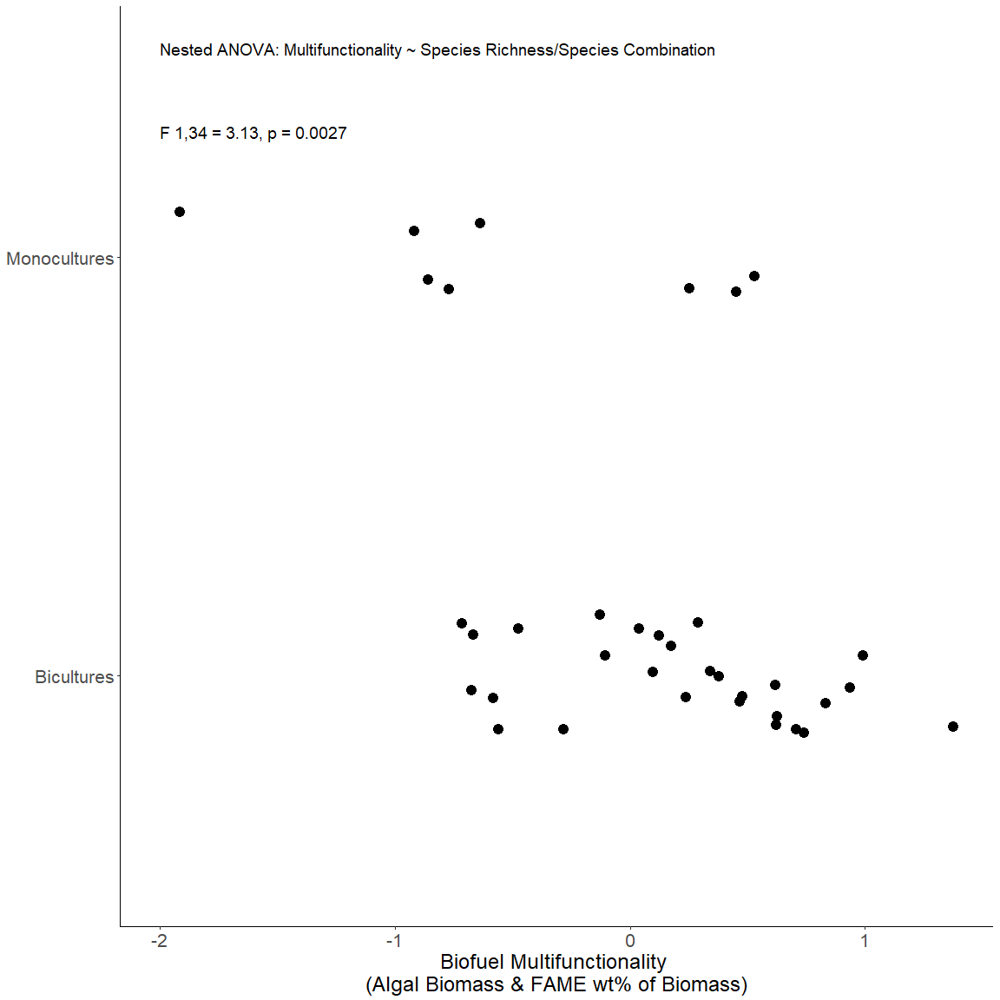

Section 2: Supplementary data for transcriptomic analyses determining differential expression of lipid genes.
=============================================================================================================

Fig. S2. In addition to figure 2 of the main text, here we illustrate in further detail that differential expression patterns are correlated against ranked relative FAME yields where the biculture yield is relative to monoculture expectations. As reported in Fig. 2., significantly differential lipid gene expression was observed only in communities overyielding in FAME and/or biomass. Solid lines connect populations growing together in biculture, shape indicates whether biculture population is above or below biomass levels that species attained in monoculture, and filled/unfilled symbols indicate whether bicultures overyielded in FAME. Populations are categorized into four subsections on the x-axis: populations significantly up/down regulating lipid genes, according to K-S tests on the distributions of log2FC values of lipid versus non-lipid genes, are given values of ± 1; otherwise populations are given values slightly above/below zero to indicate trending direction. Points are jittered on the x-axis for visual clarity. Relative FAME yield is calculated as log2FC\[(Mean Yield of Biculture A + B))/(Mean(Mean yield of species A in monoculture., Mean yield of species B in monoculture))\]. Bicultures above the dashed line produced FAME yields exceeding expectation from monoculture yields. Note that half of those populations differentially expressing lipid genes maintained biomass above levels attained in monoculture. Also note, among the top ten bicultures with the highest relative FAME yield, six bicultures have one or both species differentially regulating lipid genes. The only two bicultures showing differential expression of lipid genes that did not overyield in FAME, overyielded in biomass.

``` r
rm(list = ls())
library(ggplot2)

competition.figure<-read.csv("C:/Users/Sara/Desktop/Biofuels Genomics Github/Competition.figure.csv")

my_expression1<-expression(paste(italic("Chlorella sorokiniana")))
my_expression2<-expression(paste(italic("Closteriopsis acicularis")))
my_expression3<-expression(paste(italic("Cosmarium turpinii")))
my_expression4<-expression(paste(italic("Pandorina charkowiensis")))
my_expression5<-expression(paste(italic("Scenedesmus acuminatus")))
my_expression6<-expression(paste(italic("Selenastrum capricornutum")))
my_expression7<-expression(paste(italic("Staurastrum punctulatum")))
my_expression8<-expression(paste(italic("Tetraedron minimum")))

competition.figure$Species<-as.factor(competition.figure$Species)

ggplot(competition.figure,aes(Up.0.Down,Ranked.Combined.Relative.FAME.log2FC))+
  geom_rect(fill="light gray",alpha=0.02,aes(xmin=0, xmax=-0.75, ymin=-5, ymax=35))+
  geom_rect(fill = "light gray", alpha = 0.02,aes(xmin=0,xmax=0.75,ymin=-5,ymax=35))+
  geom_rect(fill = "light gray", alpha = 0.15,aes(xmin=-2,xmax=0-0.75,ymin=-5,ymax=35))+
  geom_rect(fill = "light gray", alpha = 0.15,aes(xmin=0.75,xmax=2,ymin=-5,ymax=35))+
  geom_point(aes(colour=Species,size=3,shape=Shapes,stroke=2))+
  geom_line(aes(group = combo))+
  xlab("Differential Expression of Lipid Genes")+
  ylab("Ranked Relative FAME Yields")+
  theme(legend.text.align = 0,legend.title.align=0.5,legend.key=element_rect(fill=NA),panel.grid.major = element_blank(), panel.grid.minor = element_blank(),panel.background = element_blank(), axis.line = element_line(colour = "black"),axis.text=element_text(size = 12),axis.title=element_text(size=14,face="plain"),legend.title=element_text(size=14),legend.text=element_text(size=14))+
  guides(color=guide_legend(override.aes=list(size=5)),shape=guide_legend(override.aes=list(size=5)))+
  scale_shape_manual(values=c("UnderNo"=22,"UnderYes"=15,"OverNo"=21,"OverYes" =16),labels = c(UnderNo="Biomass Below, not FAME Overyielding",UnderYes="Biomass Below, FAME Overyielding",OverYes="Biomass Above, FAME Overyielding",OverNo="Biomass Above, not FAME Overyielding"),name="Biomass\n and \n FAME Overyielding")+
  scale_colour_manual(values=c("red","orange","springgreen3","blue","purple","black","gray","chocolate4"),labels=c(my_expression1,my_expression2,my_expression3,my_expression4,my_expression5,my_expression6,my_expression7,my_expression8),name = "Species")+
  scale_size(range = c(1,10),guide="none")+
  geom_vline(xintercept=0,linetype="solid")+
  coord_cartesian(xlim=c(-1.2,1.2), ylim=c(0,30))+ 
  geom_hline(yintercept=7.5,linetype="dotted",size=2)+
  annotate("text",x = -1.0 , y = 9.1, label = "FAME Yield:",size=5)+
  annotate("text",x = -0.75, y = 8.1, label = "Above Monocultures",size=5)+
  annotate("text", x = -0.75, y= 6.9, label = "Below Monocultures",size=5)+
  annotate("text", x = -1, y = -0.6, label = "Significant \n Downregulation")+
  annotate("text",x=-0.35,y=-0.62,label="Trending Downregulation")+
  annotate ("text", x = 0.35, y = -0.62, label = "Trending Upregulation")+
  annotate("text",x=1,y=-0.6, label = "Significant \n Upregulation")
```

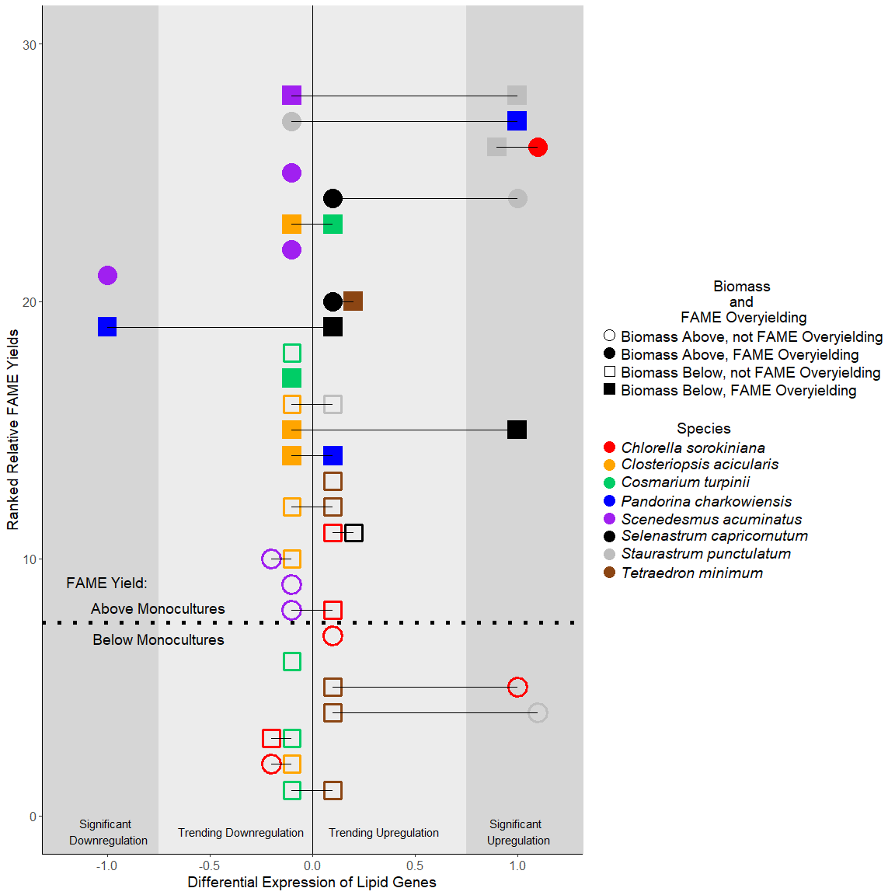

Section 3: Supplementary PCA data illustrating genomic distinctions between populations belonging to FAME overyielding versus non-overyielding bicultures.
==========================================================================================================================================================

Fig. S3. In addition to Fig. 3, here we show PC1 versus PC2 of our principal component analysis that incorporates mean log2FC values for each algal species of 28 different Gene Ontology groups involved in lipid regulatory functions. Note PC1 is largely differences across species, while PC2 and PC3 shown in Fig. 3 more clearly illustrate that bicultures overyielding versus non-overyielding in FAME production exhibit distinct patterns of gene expression.

``` r
rm(list = ls())
library(ggplot2)
Aggregated.Go.Tables<-read.csv("C:/Users/Sara/Desktop/Biofuels Genomics Github/pca.csv",header=TRUE)          
Aggregated.Go.Tables <- Aggregated.Go.Tables %>% mutate(FAME.Overyielding.2 = if_else(Biculture %in% c("logFC68","logFC86","logFC17","logFC71","logFC85","logFC58","logFC57","logFC75","logFC26","logFC62","logFC23","logFC32","logFC46","logFC64","logFC67","logFC76","logFC35","logFC53","logFC24","logFC42","logFC36","logFC63","logFC47","logFC74","logFC45","logFC54"), "Yes", "No"))
Aggregated.Go.Tables <- Aggregated.Go.Tables %>% mutate(Species = if_else(Biculture %in% c("logFC12","logFC13","logFC14","logFC15","logFC16","logFC17","logFC18"), "1",if_else(Biculture %in% c("logFC21","logFC23","logFC24","logFC25","logFC26","logFC27","logFC28"), "2",if_else(Biculture %in% c("logFC31","logFC32","logFC34","logFC35","logFC36","logFC37","logFC38"), "3",if_else(Biculture %in% c("logFC42","logFC43","logFC46","logFC47"), "4",if_else(Biculture %in% c("logFC51","logFC52","logFC53","logFC54","logFC56","logFC57","logFC58"), "5",if_else(Biculture %in% c ("logFC61","logFC62","logFC64","logFC67","logFC68"), "6",if_else(Biculture %in% c("logFC71","logFC72","logFC74","logFC75","logFC76","logFC78"), "7",if_else(Biculture %in% c("logFC81","logFC82","logFC83","logFC84","logFC86","logFC87"), "8","0")))))))))

Aggregated.Go.Tables <- Aggregated.Go.Tables %>% mutate(FAME.T.Overyielding = if_else(Biculture %in% c("logFC68","logFC17","logFC71","logFC58","logFC57","logFC75","logFC26","logFC62","logFC23","logFC32","logFC46","logFC64","logFC67","logFC76","logFC35","logFC53","logFC47","logFC74","logFC45","logFC54"), "Yes", "No"))
data<-Aggregated.Go.Tables[,1:29]
labels<-c(12,13,14,15,16,17,18,21,23,24,25,26,27,28,31,32,34,36,37,38,42,46,47,51,52,53,54,56,57,58,61,62,64,67,68,71,72,74,75,76,78,81,82,83,84,86,87)
row.names(data)<-labels
data$Biculture<-NULL
new.pca <- prcomp(data,center = TRUE)
Aggregated.Go.Tables$Species<-as.factor(Aggregated.Go.Tables$Species)
PC13<-new.pca$x[,1:3]
PC23<-new.pca$x[,2:3]
PC14<-new.pca$x[,1:4]
PC3<-new.pca$x[,3]
PC2<-new.pca$x[,2]
PC1<-new.pca$x[,1]

result<-manova(cbind(PC1,PC2,PC3)~Aggregated.Go.Tables$FAME.Overyielding+Aggregated.Go.Tables$Species)
result<-aov(PC1~Aggregated.Go.Tables$FAME.Overyielding.2+Aggregated.Go.Tables$Species)
result<-aov(PC2~Aggregated.Go.Tables$FAME.Overyielding.2+Aggregated.Go.Tables$Species)
result<-aov(PC3~Aggregated.Go.Tables$FAME.Overyielding.2+Aggregated.Go.Tables$Species)

Aggregated.Go.Tables <- Aggregated.Go.Tables %>% mutate(FAME.Overyielding.3 = if_else(FAME.Overyielding.2 %in% c("Yes"), "1", "0"))
Aggregated.Go.Tables$FAME.Overyielding.3<-as.numeric(Aggregated.Go.Tables$FAME.Overyielding.3)

my_expression<-expression(paste(italic("Chlorella sorokiniana")))
my_expression1<-expression(paste(italic("Closteriopsis acicularis")))
my_expression2<-expression(paste(italic("Cosmarium turpinii")))
my_expression3<-expression(paste(italic("Pandorina charkowiensis")))
my_expression4<-expression(paste(italic("Scenedesmus acuminatus")))
my_expression5<-expression(paste(italic("Selenastrum capricornutum")))
my_expression6<-expression(paste(italic("Staurastrum punctulatum")))
my_expression7<-expression(paste(italic("Tetraedron minimum")))
Yes<-data.frame(PC2=0.02422156,PC3=-0.1920427)
No<-data.frame(PC2=-0.02131497,PC3=0.1689975)
data<-cbind(new.pca$x,Aggregated.Go.Tables[,30:32],Aggregated.Go.Tables[,1])
data$Species<-as.factor(data$Species)

ggplot(data, aes(PC1,PC2,colour=data$Species,shape=data$FAME.Overyielding,size=3))+
  geom_point()+
  theme(legend.text.align = 0,legend.title.align=0.5,legend.key=element_rect(fill=NA),panel.grid.major = element_blank(), panel.grid.minor = element_blank(),panel.background = element_blank(), axis.line = element_line(colour = "black"),axis.text=element_text(size = 12),axis.title=element_text(size=14,face="plain"),legend.title=element_text(size=14),legend.text=element_text(size=14))+
  guides(color=guide_legend(override.aes=list(size=5)),shape=guide_legend(override.aes=list(size=5)))+
  scale_shape_manual("FAME Overyielding",labels=c("Not Overyielding", "Overyielding"),values=c(16,7))+
  scale_colour_manual("Species",labels=c(my_expression,my_expression1,my_expression2,my_expression3,my_expression4,my_expression5,my_expression6,my_expression7),values=c("red","orange","springgreen3","blue","purple","black","gray","chocolate4"))+
  scale_size(guide="none")+
  xlab("PC1   (56.1% of Variance)")+
  ylab ("PC2   (16.1% of Variance)")
```

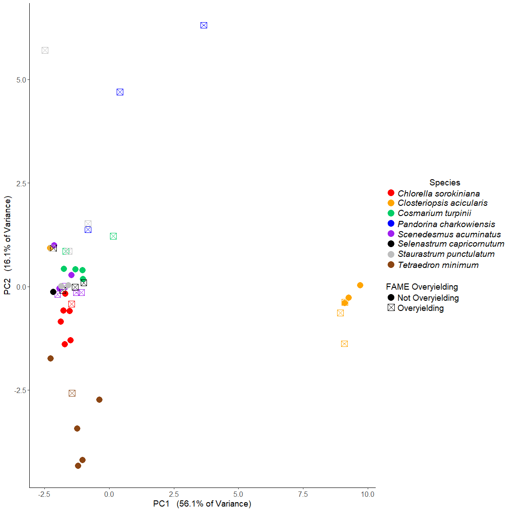

Section 4: Shifts in expression at the gene-level correlates with biocrude quality metrics, including FAME, Cetane Number, and Higher Heating Value
===================================================================================================================================================

Fig. S4. Expression levels of genes involved in lipid metabolism that are found in multiple algal species were significant predictors of FAME. Correlation between log2 fold change of gene expression and the biocrude quality metric, FAME, in biculture relative to monoculture were evaluated via simple linear regression models with FDR significance corrections.

``` r
rm(list = ls())
library(gridExtra)
library(ggplot2)
library(grid)

XP_005842867.1<-read.csv("C:/Users/Sara/Desktop/Biofuels Genomics Github/FAME_XP_005842867.1.csv")
XP_005848792.1<-read.csv("C:/Users/Sara/Desktop/Biofuels Genomics Github/FAME_XP_005848792.1.csv")
XP_005847875.1<-read.csv("C:/Users/Sara/Desktop/Biofuels Genomics Github/FAME_XP_005847875.1.csv")
XP_005850190.1<-read.csv("C:/Users/Sara/Desktop/Biofuels Genomics Github/FAME_XP_005850190.1.csv")
XP_005850208.1<-read.csv("C:/Users/Sara/Desktop/Biofuels Genomics Github/FAME_XP_005850208.1.csv")

my_expression1<-expression(paste(italic("Chlorella sorokiniana")))
my_expression2<-expression(paste(italic("Closteriopsis acicularis")))
my_expression3<-expression(paste(italic("Cosmarium turpinii")))
my_expression4<-expression(paste(italic("Pandorina charkowiensis")))
my_expression5<-expression(paste(italic("Scenedesmus acuminatus")))
my_expression6<-expression(paste(italic("Selenastrum capricornutum")))
my_expression7<-expression(paste(italic("Staurastrum punctulatum")))
my_expression8<-expression(paste(italic("Tetraedron minimum")))

my_grob = grobTree(textGrob(bquote(Adjusted~R^2 == .(paste(round(70.2334046, 2)))), x=0.65,  y=0.9, hjust=0, gp=gpar(col="black", fontsize=12, fontface="italic")))
XP_005842867.1.plot<-ggplot(XP_005842867.1,aes(logFC,log2ratioofFAME))+
  geom_point(aes(colour=factor(Species),shape=Overyielding,size=3)) +
  geom_smooth(method=lm,colour='black',fullrange=TRUE)+
  theme(legend.text.align = 0,legend.key=element_rect(fill=NA),panel.grid.major = element_blank(), panel.grid.minor = element_blank(),panel.background = element_blank(), axis.line = element_line(colour = "black"),axis.text=element_text(size = 12),axis.title=element_text(size=14,face="plain"),legend.title=element_text(size=12),legend.text=element_text(size=12))+
  xlab("Log2FC of XP_005842867.1 \n Fatty Acid Biosynthetic Process")+
  ylab("FAME  (Log2FC)")+
  annotation_custom(my_grob)+
  scale_colour_manual(guide="none","Algal Species",labels=c(my_expression1,my_expression2,my_expression7),values=c("red","orange","gray"))+
  scale_shape_manual(guide="none","FAME Overyielding",labels=c("Not Overyielding","Overyielding"),values=c(16,7))+
  scale_size(guide="none")+
  scale_x_continuous(expand=c(0,0),limits=c(-5,5)) +
  scale_y_continuous(expand=c(0,0),limits=c(-5,5)) +
  coord_cartesian(xlim=c(-1,0.5), ylim=c(-1,2)) 

my_grob = grobTree(textGrob(bquote(Adjusted~R^2 == .(paste(round(38.0447284, 2)))), x=0.65,  y=0.9, hjust=0, gp=gpar(col="black", fontsize=12, fontface="italic")))
XP_005848792.1.plot<-ggplot(XP_005848792.1,aes(logFC,log2ratioofFAME))+
  geom_point(aes(colour=factor(Species),shape=Overyielding,size=3)) +
  geom_smooth(method=lm,colour='black',fullrange=TRUE)+
  theme(legend.text.align = 0,legend.key=element_rect(fill=NA),panel.grid.major = element_blank(), panel.grid.minor = element_blank(),panel.background = element_blank(), axis.line = element_line(colour = "black"),axis.text=element_text(size = 12),axis.title=element_text(size=14,face="plain"),legend.title=element_text(size=12),legend.text=element_text(size=12))+
  xlab("Log2FC of XP_005848792.1 \n Phospholipid Biosynthetic Process")+
  ylab("FAME  (Log2FC)")+
  annotation_custom(my_grob)+
  scale_colour_manual(guide="none","Algal Species",labels=c(my_expression1,my_expression2,my_expression3,my_expression4,my_expression5,my_expression6,my_expression7),values=c("red","orange","springgreen3","blue","purple","black","gray"))+
  scale_shape_manual(guide="none","FAME Overyielding",labels=c("Not Overyielding","Overyielding"),values=c(16,7))+
  scale_size(guide="none")+
  scale_x_continuous(expand=c(0,0),limits=c(-5,5)) +
  scale_y_continuous(expand=c(0,0),limits=c(-5,5)) +
  coord_cartesian(xlim=c(-4.5,1.5), ylim=c(-1,2)) 

my_grob = grobTree(textGrob(bquote(Adjusted~R^2 == .(paste(round(51.4952323, 2)))), x=0.65,  y=0.9, hjust=0, gp=gpar(col="black", fontsize=12, fontface="italic")))
XP_005847875.1.plot<-ggplot(XP_005847875.1,aes(logFC,log2ratioofFAME))+
  geom_point(aes(colour=factor(Species),shape=Overyielding,size=3)) +
  geom_smooth(method=lm,colour='black',fullrange=TRUE)+
  theme(legend.text.align = 0,legend.key=element_rect(fill=NA),panel.grid.major = element_blank(), panel.grid.minor = element_blank(),panel.background = element_blank(), axis.line = element_line(colour = "black"),axis.text=element_text(size = 12),axis.title=element_text(size=14,face="plain"),legend.title=element_text(size=12),legend.text=element_text(size=12))+
  xlab("Log2FC of XP_005847875.1 \n Phospholipid Metabolic Process")+
  ylab("FAME  (Log2FC)")+
  annotation_custom(my_grob)+
  scale_colour_manual(guide="none","Algal Species",labels=c(my_expression1,my_expression4,my_expression5,my_expression6),values=c("red","blue","purple","black"))+
  scale_shape_manual(guide="none","FAME Overyielding",labels=c("Not Overyielding","Overyielding"),values=c(16,7))+
  scale_size(guide="none")+
  scale_x_continuous(expand=c(0,0),limits=c(-15,15)) +
  scale_y_continuous(expand=c(0,0),limits=c(-15,15)) +
  coord_cartesian(xlim=c(-4,2), ylim=c(-1,1.5)) 

my_grob = grobTree(textGrob(bquote(Adjusted~R^2 == .(paste(round(66.4451275, 2)))), x=0.65,  y=0.9, hjust=0, gp=gpar(col="black", fontsize=12, fontface="italic")))
XP_005850190.1.plot<-ggplot(XP_005850190.1,aes(logFC,log2ratioofFAME))+
  geom_point(aes(colour=factor(Species),shape=Overyielding,size=3)) +
  geom_smooth(method=lm,colour='black',fullrange=TRUE)+
  theme(legend.text.align = 0,legend.key=element_rect(fill=NA),panel.grid.major = element_blank(), panel.grid.minor = element_blank(),panel.background = element_blank(), axis.line = element_line(colour = "black"),axis.text=element_text(size = 12),axis.title=element_text(size=14,face="plain"),legend.title=element_text(size=12),legend.text=element_text(size=12))+
  xlab("Log2FC of XP_005850190.1 \n Protein Lipidation")+
  ylab("FAME  (Log2FC)")+
  annotation_custom(my_grob)+
  scale_colour_manual(guide="none","Algal Species",labels=c(my_expression4,my_expression6,my_expression8),values=c("blue","black","chocolate4"))+
  scale_shape_manual(guide="none","FAME Overyielding",labels=c("Not Overyielding","Overyielding"),values=c(16,7))+
  scale_size(guide="none")+
  scale_x_continuous(expand=c(0,0),limits=c(-5,5)) +
  scale_y_continuous(expand=c(0,0),limits=c(-5,5)) +
  coord_cartesian(xlim=c(-1.5,1.2), ylim=c(-1.2,1.5)) 

my_grob = grobTree(textGrob(bquote(Adjusted~R^2 == .(paste(round(28.1333504, 2)))), x=0.65,  y=0.90, hjust=0, gp=gpar(col="black", fontsize=12, fontface="italic")))
XP_005850208.1.plot<-ggplot(XP_005850208.1,aes(logFC,log2ratioofFAME))+
  geom_point(aes(colour=factor(Species),shape=Overyielding,size=3)) +
  geom_smooth(method=lm,colour='black',fullrange=TRUE)+
  theme(legend.text.align = 0,legend.key=element_rect(fill=NA),panel.grid.major = element_blank(), panel.grid.minor = element_blank(),panel.background = element_blank(), axis.line = element_line(colour = "black"),axis.text=element_text(size = 12),axis.title=element_text(size=14,face="plain"),legend.title=element_text(size=12),legend.text=element_text(size=12))+
  xlab("Log2FC of XP_005850208.1 \n Phospholipid-transporting ATPase")+
  ylab("FAME  (Log2FC)")+
  annotation_custom(my_grob)+
  scale_colour_manual(guide="none","Algal Species",labels=c(my_expression2,my_expression3,my_expression4,my_expression5,my_expression6,my_expression7,my_expression8),values=c("orange","springgreen3","blue","purple","black","gray","chocolate4"))+
  scale_shape_manual(guide="none","FAME Overyielding",labels=c("Not Overyielding","Overyielding"),values=c(16,7))+
  scale_size(guide="none")+
  scale_x_continuous(expand=c(0,0),limits=c(-5,5)) +
  scale_y_continuous(expand=c(0,0),limits=c(-5,5)) +
  coord_cartesian(xlim=c(-1.5,1.0), ylim=c(-1.1,2)) 

grid.arrange(XP_005842867.1.plot,XP_005848792.1.plot,XP_005847875.1.plot,XP_005850190.1.plot,XP_005850208.1.plot,ncol = 2)
```

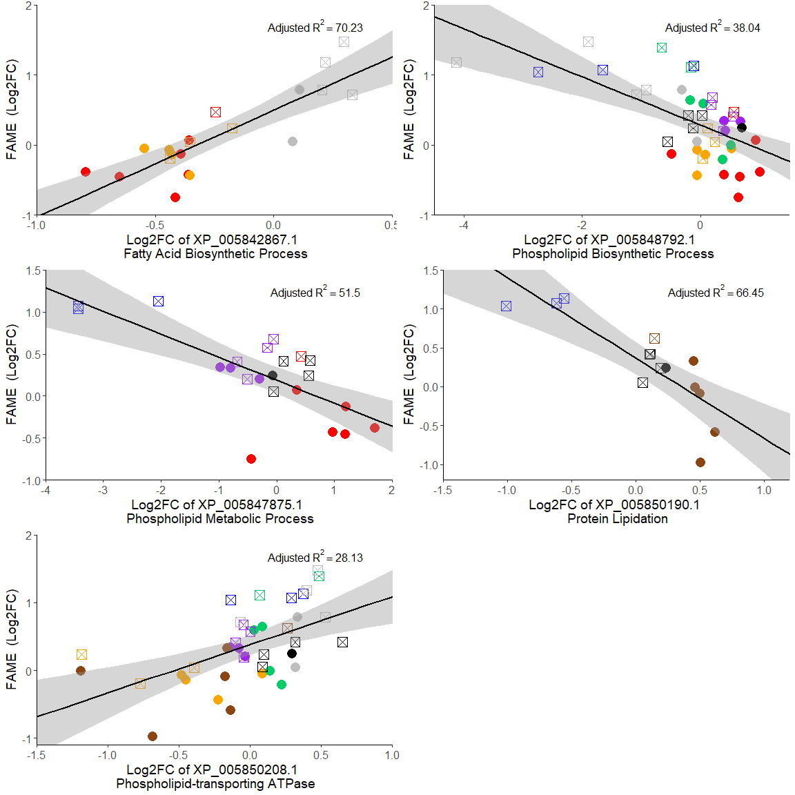

Fig. S5. Expression levels of genes involved in lipid metabolism that are found in multiple algal species were significant predictors of Cetane Number. Correlation between log2 fold change of gene expression and the biocrude quality metric, Cetane Number, in biculture relative to monoculture were evaluated via simple linear regression models with FDR significance corrections.

``` r
rm(list = ls())
library(gridExtra)
library(ggplot2)
library(grid)

my_expression1<-expression(paste(italic("Chlorella sorokiniana")))
my_expression2<-expression(paste(italic("Closteriopsis acicularis")))
my_expression3<-expression(paste(italic("Cosmarium turpinii")))
my_expression4<-expression(paste(italic("Pandorina charkowiensis")))
my_expression5<-expression(paste(italic("Scenedesmus acuminatus")))
my_expression6<-expression(paste(italic("Selenastrum capricornutum")))
my_expression7<-expression(paste(italic("Staurastrum punctulatum")))
my_expression8<-expression(paste(italic("Tetraedron minimum")))

XP_005845528.1<-read.csv("C:/Users/Sara/Desktop/Biofuels Genomics Github/CetaneNumber_XP_005845528.1.csv")
XP_005845378.1<-read.csv("C:/Users/Sara/Desktop/Biofuels Genomics Github/CetaneNumber_XP_005845378.1.csv")
XP_005842867.1<-read.csv("C:/Users/Sara/Desktop/Biofuels Genomics Github/CetaneNumber_XP_005842867.1.csv")

my_grob = grobTree(textGrob(bquote(Adjusted~R^2 == .(paste(round(52.6458974, 2)))), x=0.65,  y=0.9, hjust=0, gp=gpar(col="black", fontsize=12, fontface="italic")))
XP_005845528.1.plot<-ggplot(XP_005845528.1,aes(logFC,log2FCofCN))+
  geom_point(aes(colour=factor(Species),size=3)) +
  geom_smooth(method=lm,colour='black',fullrange=TRUE)+
  theme(legend.text.align = 0,legend.key=element_rect(fill=NA),panel.grid.major = element_blank(), panel.grid.minor = element_blank(),panel.background = element_blank(), axis.line = element_line(colour = "black"),axis.text=element_text(size = 12),axis.title=element_text(size=14,face="plain"),legend.title=element_text(size=12),legend.text=element_text(size=12))+
  xlab("Log2FC of XP_005845528.1 \n Lipid Binding")+
  ylab("Cetane Number  (Log2FC)")+
  annotation_custom(my_grob)+
  scale_colour_manual(guide="none","Algal Species",labels=c(my_expression1,my_expression2,my_expression3,my_expression4,my_expression5,my_expression7),values=c("red","orange","springgreen3","blue","purple","gray"))+
  scale_size(guide="none")+
  scale_x_continuous(expand=c(0,0),limits=c(-5,5)) +
  scale_y_continuous(expand=c(0,0),limits=c(-5,5)) +
  coord_cartesian(xlim=c(-2.1,1), ylim=c(-.4,0.4)) 

my_grob = grobTree(textGrob(bquote(Adjusted~R^2 == .(paste(round(77.5545991, 2)))), x=0.65,  y=0.9, hjust=0, gp=gpar(col="black", fontsize=12, fontface="italic")))
XP_005845378.1.plot<-ggplot(XP_005845378.1,aes(logFC,log2FCofCN))+
  geom_point(aes(colour=factor(Species),size=3)) +
  geom_smooth(method=lm,colour='black',fullrange=TRUE)+
  theme(legend.text.align = 0,legend.key=element_rect(fill=NA),panel.grid.major = element_blank(), panel.grid.minor = element_blank(),panel.background = element_blank(), axis.line = element_line(colour = "black"),axis.text=element_text(size = 12),axis.title=element_text(size=14,face="plain"),legend.title=element_text(size=12),legend.text=element_text(size=12))+
  xlab("Log2FC of XP_005845378.1 \n Lipid Metabolic Process")+
  ylab("Cetane Number  (Log2FC)")+
  annotation_custom(my_grob)+
  scale_colour_manual(guide="none","Algal Species",labels=c(my_expression1,my_expression2),values=c("red","orange"))+
  scale_size(guide="none")+
  scale_x_continuous(expand=c(0,0),limits=c(-15,15)) +
  scale_y_continuous(expand=c(0,0),limits=c(-15,15)) +
  coord_cartesian(xlim=c(-2,4), ylim=c(-.4,0.1)) 

my_grob = grobTree(textGrob(bquote(Adjusted~R^2 == .(paste(round(51.0673878, 2)))), x=0.05,  y=0.90, hjust=0, gp=gpar(col="black", fontsize=12, fontface="italic")))
XP_005842867.1.plot<-ggplot(XP_005842867.1,aes(logFC,log2FCofCN))+
  geom_point(aes(colour=factor(Species),size=3)) +
  geom_smooth(method=lm,colour='black',fullrange=TRUE)+
  theme(legend.text.align = 0,legend.key=element_rect(fill=NA),panel.grid.major = element_blank(), panel.grid.minor = element_blank(),panel.background = element_blank(), axis.line = element_line(colour = "black"),axis.text=element_text(size = 12),axis.title=element_text(size=14,face="plain"),legend.title=element_text(size=12),legend.text=element_text(size=12))+
  xlab("Log2FC of XP_005842867.1 \n Fatty Acid Biosynthetic Process")+
  ylab("Cetane Number  (Log2FC)")+
  annotation_custom(my_grob)+
  scale_colour_manual(guide="none","Algal Species",labels=c(my_expression1,my_expression2,my_expression7),values=c("red","orange","gray"))+
  scale_size(guide="none")+
  scale_x_continuous(expand=c(0,0),limits=c(-15,15)) +
  scale_y_continuous(expand=c(0,0),limits=c(-15,15)) +
  coord_cartesian(xlim=c(-1,0.5), ylim=c(-.5,0.3)) 

grid.arrange(XP_005845528.1.plot,XP_005845378.1.plot,XP_005842867.1.plot,ncol = 1)
```

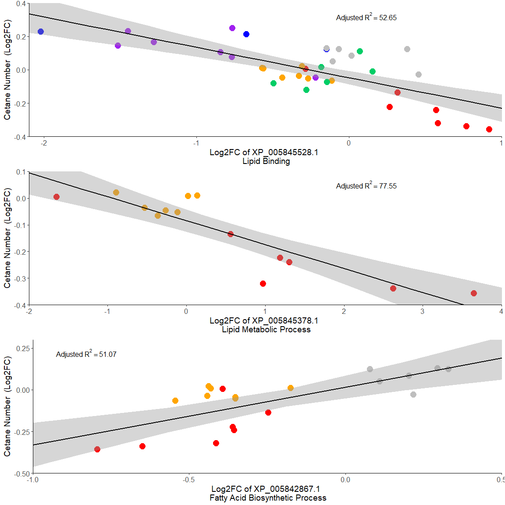

Fig. S6. Expression levels of genes involved in lipid metabolism that are found in multiple algal species were significant predictors of Higher Heating Value. Correlation between log2 fold change of gene expression and the biocrude quality metric, Higher Heating Value, in biculture relative to monoculture were evaluated via simple linear regression models with FDR significance corrections.

``` r
rm(list = ls())
library(gridExtra)
library(ggplot2)
library(grid)

my_expression1<-expression(paste(italic("Chlorella sorokiniana")))
my_expression2<-expression(paste(italic("Closteriopsis acicularis")))
my_expression3<-expression(paste(italic("Cosmarium turpinii")))
my_expression4<-expression(paste(italic("Pandorina charkowiensis")))
my_expression5<-expression(paste(italic("Scenedesmus acuminatus")))
my_expression6<-expression(paste(italic("Selenastrum capricornutum")))
my_expression7<-expression(paste(italic("Staurastrum punctulatum")))
my_expression8<-expression(paste(italic("Tetraedron minimum")))

XP_005843528.1<-read.csv("C:/Users/Sara/Desktop/Biofuels Genomics Github/HHV_XP_005843528.1.csv")
XP_005851543.1<-read.csv("C:/Users/Sara/Desktop/Biofuels Genomics Github/HHV_XP_005851543.1.csv")
XP_005850941.1<-read.csv("C:/Users/Sara/Desktop/Biofuels Genomics Github/HHV_XP_005850941.1.csv")
XP_005847908.1<-read.csv("C:/Users/Sara/Desktop/Biofuels Genomics Github/HHV_XP_005847908.1.csv")
XP_005849398.1<-read.csv("C:/Users/Sara/Desktop/Biofuels Genomics Github/HHV_XP_005849398.1.csv")

my_grob = grobTree(textGrob(bquote(Adjusted~R^2 == .(paste(round(70.1110228, 2)))), x=0.03,  y=0.93, hjust=0, gp=gpar(col="black", fontsize=12, fontface="italic")))
XP_005843528.1.plot<-ggplot(XP_005843528.1,aes(logFC,log2FCofHHV))+
  geom_point(aes(colour=factor(Species),size=3)) +
  geom_smooth(method=lm,colour='black',fullrange=TRUE)+
  theme(legend.text.align = 0,legend.key=element_rect(fill=NA),panel.grid.major = element_blank(), panel.grid.minor = element_blank(),panel.background = element_blank(), axis.line = element_line(colour = "black"),axis.text=element_text(size = 12),axis.title=element_text(size=14,face="plain"),legend.title=element_text(size=12),legend.text=element_text(size=12))+
  xlab("Log2FC of XP_005843528.1 \n Fatty Acid Biosynthetic Process")+
  ylab("Higher Heating Value\n  (Log2FC)")+
  annotation_custom(my_grob)+
  scale_colour_manual(guide="none","Algal Species",labels=c(my_expression5,my_expression6,my_expression8),values=c("purple","black","chocolate4"))+
  scale_size(guide="none")+
  scale_x_continuous(expand=c(0,0),limits=c(-15,15)) +
  scale_y_continuous(expand=c(0,0),limits=c(-15,15)) +
  coord_cartesian(xlim=c(-9,3.5), ylim=c(-.015,0.005)) 

my_grob = grobTree(textGrob(bquote(Adjusted~R^2 == .(paste(round(80.3329379, 2)))), x=0.03,  y=0.93, hjust=0, gp=gpar(col="black", fontsize=12, fontface="italic")))
XP_005851543.1.plot<-ggplot(XP_005851543.1,aes(logFC,log2FCofHHV))+
  geom_point(aes(colour=factor(Species),size=3)) +
  geom_smooth(method=lm,colour='black',fullrange=TRUE)+
  theme(legend.text.align = 0,legend.key=element_rect(fill=NA),panel.grid.major = element_blank(), panel.grid.minor = element_blank(),panel.background = element_blank(), axis.line = element_line(colour = "black"),axis.text=element_text(size = 12),axis.title=element_text(size=14,face="plain"),legend.title=element_text(size=12),legend.text=element_text(size=12))+
  xlab("Log2FC of XP_005851543.1 \n Lipid Storage")+
  ylab("Higher Heating Value\n  (Log2FC)")+
  annotation_custom(my_grob)+
  scale_colour_manual(guide="none","Algal Species",labels=c(my_expression5,my_expression6),values=c("purple","black"))+
  scale_size(guide="none")+
  scale_x_continuous(expand=c(0,0),limits=c(-15,15)) +
  scale_y_continuous(expand=c(0,0),limits=c(-15,15)) +
  coord_cartesian(xlim=c(-0.6,0.9), ylim=c(-0.015,0.0055)) 

my_grob = grobTree(textGrob(bquote(Adjusted~R^2 == .(paste(round(28.5532014, 2)))), x=0.03,  y=0.93, hjust=0, gp=gpar(col="black", fontsize=12, fontface="italic")))
XP_005850941.1.plot<-ggplot(XP_005850941.1,aes(logFC,log2FCofHHV))+
  geom_point(aes(colour=factor(Species),size=3)) +
  geom_smooth(method=lm,colour='black',fullrange=TRUE)+
  theme(legend.text.align = 0,legend.key=element_rect(fill=NA),panel.grid.major = element_blank(), panel.grid.minor = element_blank(),panel.background = element_blank(), axis.line = element_line(colour = "black"),axis.text=element_text(size = 12),axis.title=element_text(size=14,face="plain"),legend.title=element_text(size=12),legend.text=element_text(size=12))+
  xlab("Log2FC of XP_005850941.1 \n Fatty Acid Biosynthetic Process")+
  ylab("Higher Heating Value\n  (Log2FC)")+
  annotation_custom(my_grob)+
  scale_colour_manual(guide="none","Algal Species",labels=c(my_expression1,my_expression2,my_expression3,my_expression4,my_expression5,my_expression6,my_expression7,my_expression8),values=c("red","orange","springgreen3","blue","purple","black","gray","chocolate4"))+
  scale_size(guide="none")+
  scale_x_continuous(expand=c(0,0),limits=c(-15,15)) +
  scale_y_continuous(expand=c(0,0),limits=c(-15,15)) +
  coord_cartesian(xlim=c(-4.0,3.0), ylim=c(-0.015,0.0055)) 

my_grob = grobTree(textGrob(bquote(Adjusted~R^2 == .(paste(round(70.9610374, 2)))), x=0.65,  y=0.93, hjust=0, gp=gpar(col="black", fontsize=12, fontface="italic")))
XP_005847908.1.plot<-ggplot(XP_005847908.1,aes(logFC,log2FCofHHV))+
  geom_point(aes(colour=factor(Species),size=3)) +
  geom_smooth(method=lm,colour='black',fullrange=TRUE)+
  theme(legend.text.align = 0,legend.key=element_rect(fill=NA),panel.grid.major = element_blank(), panel.grid.minor = element_blank(),panel.background = element_blank(), axis.line = element_line(colour = "black"),axis.text=element_text(size = 12),axis.title=element_text(size=14,face="plain"),legend.title=element_text(size=12),legend.text=element_text(size=12))+
  xlab("Log2FC of XP_005847908.1 \n Lipid A Biosynthetic Process")+
  ylab("Higher Heating Value\n  (Log2FC)")+
  annotation_custom(my_grob)+
  scale_colour_manual(guide="none","Algal Species",labels=c(my_expression5,my_expression8),values=c("purple","chocolate4"))+
  scale_size(guide="none")+
  scale_x_continuous(expand=c(0,0),limits=c(-15,15)) +
  scale_y_continuous(expand=c(0,0),limits=c(-15,15)) +
  coord_cartesian(xlim=c(-0.75,1.1), ylim=c(-0.015,0.0055)) 

my_grob = grobTree(textGrob(bquote(Adjusted~R^2 == .(paste(round(25.1150729, 2)))), x=0.65,  y=0.93, hjust=0, gp=gpar(col="black", fontsize=12, fontface="italic")))
XP_005849398.1.plot<-ggplot(XP_005849398.1,aes(logFC,log2FCofHHV))+
  geom_point(aes(colour=factor(Species),size=3)) +
  geom_smooth(method=lm,colour='black',fullrange=TRUE)+
  theme(legend.text.align = 0,legend.key=element_rect(fill=NA),panel.grid.major = element_blank(), panel.grid.minor = element_blank(),panel.background = element_blank(), axis.line = element_line(colour = "black"),axis.text=element_text(size = 12),axis.title=element_text(size=14,face="plain"),legend.title=element_text(size=12),legend.text=element_text(size=12))+
  xlab("Log2FC of XP_005849398.1 \n Glycolipid Transporter Activity")+
  ylab("Higher Heating Value\n  (Log2FC)")+
  annotation_custom(my_grob)+
  scale_colour_manual(guide="none","Algal Species",labels=c(my_expression1,my_expression2,my_expression3,my_expression4,my_expression5,my_expression6,my_expression7,my_expression8),values=c("red","orange","springgreen3","blue","purple","black","gray","chocolate4"))+
  scale_size(guide="none")+
  scale_x_continuous(expand=c(0,0),limits=c(-15,15)) +
  scale_y_continuous(expand=c(0,0),limits=c(-15,15)) +
  coord_cartesian(xlim=c(-1.5,1), ylim=c(-0.015,0.0055)) 

grid.arrange(XP_005843528.1.plot,XP_005851543.1.plot,XP_005850941.1.plot,XP_005847908.1.plot,XP_005849398.1.plot,ncol = 2)
```

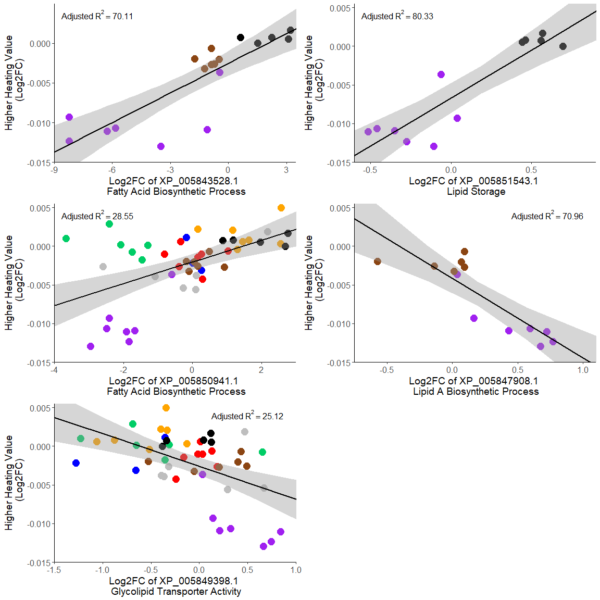

Additional Analyses
-------------------

Fig.2 of the main text and the supplementary figure that provides further details of Fig.2 are based on ranked relative FAME yields. Here we provide alternative illustrations using a) unranked Relative FAME yields, and b) unranked Total FAME Yields that are not relative to monoculture expectations.

``` r
rm(list = ls())
library(gridExtra)
library(ggplot2)
library(grid)

competition.figure<-read.csv("C:/Users/Sara/Desktop/Biofuels Genomics Github/Competition.figure.csv")
my_expression1<-expression(paste(italic("Chlorella sorokiniana")))
my_expression2<-expression(paste(italic("Closteriopsis acicularis")))
my_expression3<-expression(paste(italic("Cosmarium turpinii")))
my_expression4<-expression(paste(italic("Pandorina charkowiensis")))
my_expression5<-expression(paste(italic("Scenedesmus acuminatus")))
my_expression6<-expression(paste(italic("Selenastrum capricornutum")))
my_expression7<-expression(paste(italic("Staurastrum punctulatum")))
my_expression8<-expression(paste(italic("Tetraedron minimum")))
competition.figure$Species<-as.factor(competition.figure$Species)
ggplot(competition.figure,aes(Up.0.Down,Combined.Relative.FAME.log2FC))+
  geom_rect(fill="light gray",alpha=0.02,aes(xmin=0, xmax=-0.75, ymin=-5, ymax=35))+
  geom_rect(fill = "light gray", alpha = 0.02,aes(xmin=0,xmax=0.75,ymin=-5,ymax=35))+
  geom_rect(fill = "light gray", alpha = 0.15,aes(xmin=-2,xmax=0-0.75,ymin=-5,ymax=35))+
  geom_rect(fill = "light gray", alpha = 0.15,aes(xmin=0.75,xmax=2,ymin=-5,ymax=35))+
  geom_point(aes(colour=Species,size=3,shape=Shapes,stroke=2))+
  geom_line(aes(group = combo))+
  xlab("Differential Expression of Lipid Genes")+
  ylab("Relative FAME Yields \n (log2FC)")+
  theme(legend.text.align = 0,legend.title.align=0.5,legend.key=element_rect(fill=NA),panel.grid.major = element_blank(), panel.grid.minor = element_blank(),panel.background = element_blank(), axis.line = element_line(colour = "black"),axis.text=element_text(size = 12),axis.title=element_text(size=14,face="plain"),legend.title=element_text(size=14),legend.text=element_text(size=14))+
  guides(color=guide_legend(override.aes=list(size=5)),shape=guide_legend(override.aes=list(size=5)))+
  scale_shape_manual(values=c("UnderNo"=22,"UnderYes"=15,"OverNo"=21,"OverYes" =16),labels = c(UnderNo="Below K, not FAME Overyielding",UnderYes="Below K, FAME Overyielding",OverYes="Above K, FAME Overyielding",OverNo="Above K, not FAME Overyielding"),name="Cell Density \n (Relative to Monoculture)\n and \n FAME Overyielding")+
  scale_colour_manual(values=c("red","orange","springgreen3","blue","purple","black","gray","chocolate4"),labels=c(my_expression1,my_expression2,my_expression3,my_expression4,my_expression5,my_expression6,my_expression7,my_expression8),name = "Species")+
  scale_size(guide="none")+
  geom_hline(yintercept=0,linetype="dotted",size=2)+
  annotate("text",x = -1.0 , y = 0.12, label = "FAME Yield:  ",size=5)+
  annotate("text",x = -0.65, y = 0.04, label = "Above Monocultures",size=5)+
  annotate("text", x = -0.65, y= -0.04, label = "Below Monocultures",size=5)+
  coord_cartesian(xlim=c(-1.2,1.2), ylim=c(-0.6,1))+ 
  geom_vline(xintercept=0,linetype="solid")+
  annotate("text", x = -1, y = -0.6, label = "Significant \n Downregulation")+
  annotate("text",x=-0.35,y=-0.62,label="Trending Downregulation")+
  annotate ("text", x = 0.35, y = -0.62, label = "Trending Upregulation")+
  annotate("text",x=1,y=-0.6, label = "Significant \n Upregulation")
```

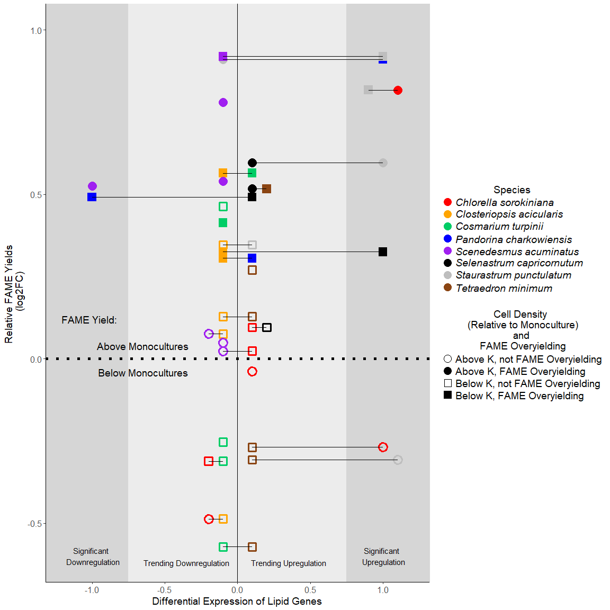

``` r
competition.figure$Species<-as.factor(competition.figure$Species)
ggplot(competition.figure,aes(Up.0.Down,rawFAME.in.Biculture))+
  geom_rect(fill="light gray",alpha=0.02,aes(xmin=0, xmax=-0.75, ymin=-5, ymax=35))+
  geom_rect(fill = "light gray", alpha = 0.02,aes(xmin=0,xmax=0.75,ymin=-5,ymax=35))+
  geom_rect(fill = "light gray", alpha = 0.15,aes(xmin=-2,xmax=0-0.75,ymin=-5,ymax=35))+
  geom_rect(fill = "light gray", alpha = 0.15,aes(xmin=0.75,xmax=2,ymin=-5,ymax=35))+
  geom_point(aes(colour=Species,size=3,shape=Shapes,stroke=2))+
  geom_line(aes(group = combo))+
  xlab("Differential Expression of Lipid Genes")+
  ylab("FAME Yields \n (wt % of sample)")+
  theme(legend.text.align = 0,legend.title.align=0.5,legend.key=element_rect(fill=NA),panel.grid.major = element_blank(), panel.grid.minor = element_blank(),panel.background = element_blank(), axis.line = element_line(colour = "black"),axis.text=element_text(size = 12),axis.title=element_text(size=14,face="plain"),legend.title=element_text(size=14),legend.text=element_text(size=14))+
  guides(color=guide_legend(override.aes=list(size=5)),shape=guide_legend(override.aes=list(size=5)))+
  scale_shape_manual(values=c("UnderNo"=22,"UnderYes"=15,"OverNo"=21,"OverYes" =16),labels = c(UnderNo="Below K, not FAME Overyielding",UnderYes="Below K, FAME Overyielding",OverYes="Above K, FAME Overyielding",OverNo="Above K, not FAME Overyielding"),name="Cell Density \n (Relative to Monoculture)\n and \n FAME Overyielding")+
  scale_colour_manual(values=c("red","orange","springgreen3","blue","purple","black","gray","chocolate4"),labels=c(my_expression1,my_expression2,my_expression3,my_expression4,my_expression5,my_expression6,my_expression7,my_expression8),name = "Species")+
  scale_size(range = c(1,5),guide="none")+
  geom_vline(xintercept=0,linetype="solid")+
  coord_cartesian(xlim=c(-1.2,1.2), ylim=c(0.01,0.27))+ 
  annotate("text", x = -1, y = 0.02, label = "Significant \n Downregulation")+
  annotate("text",x=-0.35,y=0.02,label="Trending Downregulation")+
  annotate ("text", x = 0.35, y = 0.02, label = "Trending Upregulation")+
  annotate("text",x=1,y=0.02, label = "Significant \n Upregulation")
```

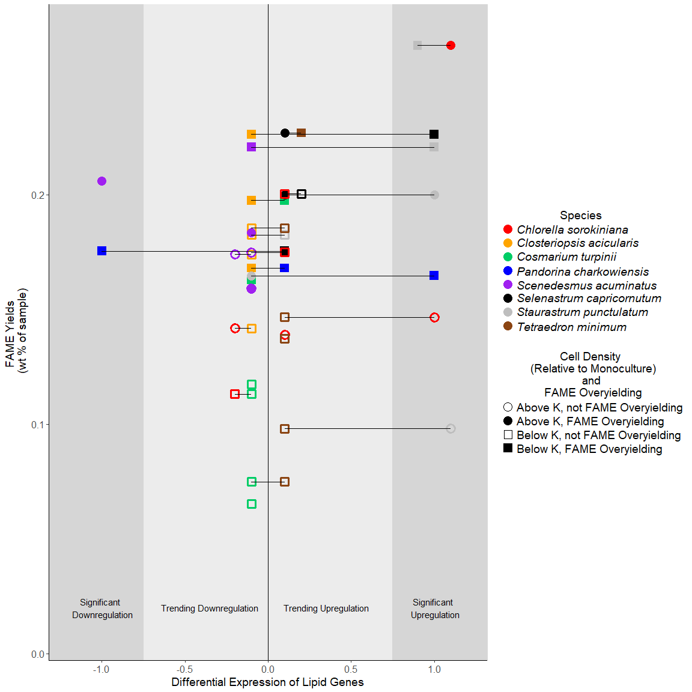

Summary of EdgeR workflow
-------------------------

Here is an example of the workflow used to calculate gene expression changes between monoculture and biculture conditions.

``` r
rm(list = ls())

library(ggplot2)
library(edgeR)
library(plyr)
library(reshape)
library(dplyr)

DC17vDC70<-read.table("C:/Users/Sara/Desktop/Biofuels Genomics Github/DC17vDC70.counts.matrix", header=T)
DC27vDC70 = read.table("C:/Users/Sara/Desktop/Biofuels Genomics Github/DC27vDC70.counts.matrix", header=T)
DC37vDC70 = read.table("C:/Users/Sara/Desktop/Biofuels Genomics Github/DC37vDC70.counts.matrix", header=T)
DC47vDC70 = read.table("C:/Users/Sara/Desktop/Biofuels Genomics Github/DC47vDC70.counts.matrix", header=T)
DC57vDC70 = read.table("C:/Users/Sara/Desktop/Biofuels Genomics Github/DC57vDC70.counts.matrix", header=T)
DC67vDC70 = read.table("C:/Users/Sara/Desktop/Biofuels Genomics Github/DC67vDC70.counts.matrix", header=T)
DC78vDC70 = read.table("C:/Users/Sara/Desktop/Biofuels Genomics Github/DC78vDC70.counts.matrix", header=T)

significant <- function(x) {
  if(x < 0.01) y <- "Sig" 
  if(x == 0.01 | x > 0.01) y <- "NS" 
  return(y)
}

lipid.function <- function(x) {
  if (x == "0") y = "0"
  else y = "1"
  return(y)
} 

df<-dplyr::full_join(DC17vDC70,DC27vDC70,by="genes")
df<-dplyr::full_join(df,DC37vDC70,by="genes")
df<-dplyr::full_join(df,DC47vDC70,by="genes")
df<-dplyr::full_join(df,DC57vDC70,by="genes")
df<-dplyr::full_join(df,DC67vDC70,by="genes")
data<-dplyr::full_join(df,DC78vDC70,by="genes")
rnaseqMatrix <- data.frame(data[,-1], row.names=data[,1])

rnaseqMatrix<-round(rnaseqMatrix)
rnaseqMatrix = rnaseqMatrix[rowSums(rnaseqMatrix)>=2,] #just trimming out the transcripts that are not very abundant
#just trimming out all of the duplicate monoculture rows from the merging step
rnaseqMatrix$DC70_R1TWB_7.y<-NULL
rnaseqMatrix$DC70_R2TWB_7.y<-NULL
rnaseqMatrix$DC70_R3TWB_7.y<-NULL
rnaseqMatrix$DC70_R1TWB_7.x.x<-NULL
rnaseqMatrix$DC70_R2TWB_7.x.x<-NULL
rnaseqMatrix$DC70_R3TWB_7.x.x<-NULL
rnaseqMatrix$DC70_R1TWB_7.y.y<-NULL
rnaseqMatrix$DC70_R2TWB_7.y.y<-NULL
rnaseqMatrix$DC70_R3TWB_7.y.y<-NULL
rnaseqMatrix$DC70_R1TWB_7.x.x.x<-NULL
rnaseqMatrix$DC70_R2TWB_7.x.x.x<-NULL
rnaseqMatrix$DC70_R3TWB_7.x.x.x<-NULL
rnaseqMatrix$DC70_R1TWB_7.y.y.y<-NULL
rnaseqMatrix$DC70_R2TWB_7.y.y.y<-NULL
rnaseqMatrix$DC70_R3TWB_7.y.y.y<-NULL
rnaseqMatrix$DC70_R1TWB_7<-NULL
rnaseqMatrix$DC70_R2TWB_7<-NULL
rnaseqMatrix$DC70_R3TWB_7<-NULL
rnaseqMatrix$DC70_R2T6_7.x.x.x<-NULL
rnaseqMatrix$DC70_R2T6_7<-NULL
rnaseqMatrix$DC70_R2T6_7.y.y.y<-NULL
rnaseqMatrix$DC70_R2T6_7.x.x<-NULL
rnaseqMatrix$DC70_R2T6_7.x.x.x<-NULL
rnaseqMatrix$DC70_R2T6_7.y<-NULL
rnaseqMatrix$DC70_R2T6_7.y.y<-NULL
rnaseqMatrix$genes<-row.names(rnaseqMatrix)
#length(unique(row.names(rnaseqMatrix))) # 61,441 genes

Sta.Green<-read.csv("C:/Users/Sara/Desktop/Biofuels Genomics Github/Sta GREEN Database.csv") 
rnaseqMatrix$genes<-row.names(rnaseqMatrix)

rnaseqMatrix.Green<-dplyr::full_join(Sta.Green,rnaseqMatrix,by = "genes")
rnaseqMatrix.Green<-rnaseqMatrix.Green[!is.na(rnaseqMatrix.Green$Diaphoretickes),]
rnaseqMatrix.Green<-rnaseqMatrix.Green[ which(rnaseqMatrix.Green$Diaphoretickes == "YES"),]
rnaseqMatrix.Green<-droplevels(rnaseqMatrix.Green)
rnaseqMatrix<-rnaseqMatrix.Green
#length(unique(rnaseqMatrix$genes)) # 12,629 green plant genes

Uniprot.2.GO<-read.csv("C:/Users/Sara/Desktop/Biofuels Genomics Github/Sta_GO_database.csv")
rnaseqMatrix$UniProt<-rnaseqMatrix$Uniprot
Uniprot.2.GO$UniProt<-Uniprot.2.GO$Uniprot
rnaseqMatrix.Green$UniProt<-rnaseqMatrix.Green$Uniprot
rnaseqMatrix.Green$Uniprot<-NULL
Uniprot.2.GO$Uniprot<-NULL
rnaseqMatrix.Green.GO<-dplyr::full_join(rnaseqMatrix.Green,Uniprot.2.GO,by="UniProt")
rnaseqMatrix.Green.GO<-rnaseqMatrix.Green.GO[!is.na(rnaseqMatrix.Green.GO$GO.Terms),]
length(unique(rnaseqMatrix.Green.GO$genes)) # 9,787 green plant genes with GO annotations
rnaseqMatrix<-rnaseqMatrix.Green.GO
rnaseqMatrix.Green.GO<-rnaseqMatrix.Green.GO[,32:33]
rnaseqMatrix[,1:4]<-NULL
rnaseqMatrix[,2:3]<-NULL
rnaseqMatrix$UniProt<-NULL
rnaseqMatrix<-unique(rnaseqMatrix)
rnaseqMatrix[,26:29]<-NULL
rnaseqMatrix<-unique(rnaseqMatrix)
rnaseqMatrix<-rnaseqMatrix[!is.na(rnaseqMatrix$genes),]
rnaseqMatrix <- data.frame(rnaseqMatrix[,-1], row.names=rnaseqMatrix[,1])

conditions = factor(c(rep("condA", 3), rep("condB", 3), rep("condC", 3), rep("condD", 3), rep("condE", 3), rep("condF", 3), rep("condG", 3), rep("condH", 3)))
exp_study = DGEList(counts=rnaseqMatrix, group=conditions)
mean(exp_study$samples$lib.size)
exp_study = calcNormFactors(exp_study, method=c('TMM'))#normalization to control for total RNA differences among samples rather than a per cell basis
exp_study = estimateCommonDisp(exp_study)
exp_study = estimateTagwiseDisp(exp_study) #now you have pseudo-counts, which represent the equivalent counts that would have been observed had the library sizes all been equal, assuming the fitted model. 
plotMDS(exp_study) #The function plotMDS produces a plot in which distances between samples correspond to leading biological coefficient of variation (BCV) between those samples
#The function plotMDS draws a multi-dimensional scaling plot of the RNA samples in which distances correspond to leading log-fold-changes between each pair of RNA samples. The leading log-fold-change is the average (root-mean-square) of the largest absolute log-foldchanges between each pair of samples. 

group<-factor(c(1,1,1,2,2,3,3,3,4,4,4,5,5,5,6,6,6,7,7,7,8,8,8))
design<-model.matrix(~0+group,data=exp_study$samples)
colnames(design) <- levels(exp_study$samples$group)
fit<-glmFit(exp_study,design)

lrt71<-glmLRT(fit,contrast=c(-1,1,0,0,0,0,0,0)) #this indicates a contrast between gene expression of Species '7' in monoculture vs. in the Species '7'/'1' biculture  
edgeR.results<-lrt71$table
lrt71$table
topTags(lrt71)
edgeR.results<-lrt71$table
edgeR.results$genes<-row.names(edgeR.results)
length(unique(edgeR.results$genes))
Gene.2.Uniprot<-read.csv("C:/Users/Sara/Desktop/Biofuels Genomics Github/Sta.Uniprot.out.csv")
edgeR.results<-dplyr::full_join(edgeR.results,Gene.2.Uniprot,by="genes")
edgeR.results<-edgeR.results[!is.na(edgeR.results$logFC),]
edgeR.results<-unique(edgeR.results)
edgeR.results$UniProt<-edgeR.results$Uniprot
rnaseqMatrix.Green.GO<-unique(rnaseqMatrix.Green.GO)
edgeR.results<-dplyr::full_join(edgeR.results,rnaseqMatrix.Green.GO,by="UniProt")
edgeR.results$Species<-NULL
edgeR.results<-unique(edgeR.results)
edgeR.results$Uniprot<-NULL
edgeR.results<-unique(edgeR.results)
edgeR.results<-edgeR.results[!is.na(edgeR.results$GO.Term),]
edgeR.results<-edgeR.results[!is.na(edgeR.results$logFC),]
AmiGO_fatty_lipid_sterol<-read.csv("C:/Users/Sara/Desktop/Biofuels Genomics Github/AmiGO fat lip sterol steryl wax.csv")
AmiGO_fatty_lipid_sterol$Lipid.Function<-AmiGO_fatty_lipid_sterol$Description
AmiGO_fatty_lipid_sterol$Description<-NULL
edgeR.results$GO.Term<-edgeR.results$GO.Terms
AmiGO_Lipids<-dplyr::full_join(AmiGO_fatty_lipid_sterol,edgeR.results,by="GO.Term")
AmiGO_Lipids<-AmiGO_Lipids[!is.na(AmiGO_Lipids$logFC),]
AmiGO_Lipids<-AmiGO_Lipids[!is.na(AmiGO_Lipids$GO.Term),]
AmiGO_Lipids$Lipid.gene.binary<-ifelse(is.na(AmiGO_Lipids$Lipid.Function),0,1)
New<-aggregate(AmiGO_Lipids$Lipid.gene.binary,list(genes = AmiGO_Lipids$genes),sum)
AmiGO_Lipids<-dplyr::full_join(New,AmiGO_Lipids, by = 'genes')
AmiGO_Lipids$Lipid.Gene<-AmiGO_Lipids$x
AmiGO_Lipids$x<-NULL
New<-AmiGO_Lipids[(AmiGO_Lipids$Lipid.gene.binary == 1),]
List.of.Lipid.Genes.Sp7<-unique(New$genes)
Go.Table.71<-New[1:4]
AmiGO_Lipids$Lipid.Function<-NULL
AmiGO_Lipids$FDR<-p.adjust(AmiGO_Lipids$PValue, method="BH")
AmiGO_Lipids$sig <- sapply(AmiGO_Lipids$FDR,significant)
AmiGO_Lipids$Lipid.Gene<-sapply(AmiGO_Lipids$Lipid.Gene,lipid.function)
AmiGO_Lipids<-unique(AmiGO_Lipids)
AmiGO_Lipids$Lipid.Gene
AmiGO_Lipids$Species<-NULL
AmiGO_Lipids$GO.Term<-NULL
AmiGO_Lipids$GO.Terms<-NULL
AmiGO_Lipids$Lipid.gene.binary<-NULL
AmiGO_Lipids<-unique(AmiGO_Lipids)
Append.Lipids<-AmiGO_Lipids[,1:6]
Append.Lipids[,2:5]<-NULL  
edgeR.results<-dplyr::full_join(Append.Lipids,edgeR.results,by="genes")
plot.GO.Lipids<- ggplot(AmiGO_Lipids, aes(y = Lipid.Gene, x = logFC)) + 
  xlim(min(AmiGO_Lipids$logFC),max(AmiGO_Lipids$logFC)) +
  geom_vline(xintercept = 0, colour="grey", linetype = "longdash") +
  geom_hline(yintercept=c(0.5),colour="grey",linetype="dotted") +
  xlab("log2fold Monoculture:Biculture") + 
  scale_y_discrete(breaks=c()) +
  geom_jitter(position = position_jitter(height = 0.4),alpha=0.7) + 
  scale_shape_manual(name = "p-value", breaks = c("Sig", "NS"),labels = c("p<0.01", "p>0.01"),values = c("NS" = 21, "Sig"= 19)) +
  theme(plot.title = element_text(face="bold", size=7),strip.text.x = element_blank(),strip.text.y = element_blank(),strip.background = element_blank(),  axis.title.x = element_text(face="bold", size=7), axis.title.y = element_blank(), axis.text.x = element_text(angle=0, colour = "black",vjust=1, hjust = 1, size=7), axis.text.y = element_text(size = 7),legend.title = element_text(size = 8, face="bold"),legend.text = element_text(size = 8),legend.position = "right", panel.grid.major.y = element_blank(),panel.grid.major.x = element_blank()) 
testing<-aggregate(AmiGO_Lipids$logFC,list(lipid.genes = AmiGO_Lipids$Lipid.Gene),mean)
result<-aov(logFC~Lipid.Gene,data=AmiGO_Lipids)
AmiGO_Lipids$Lipid.Gene<-as.factor(AmiGO_Lipids$Lipid.Gene)
kruskal.test(logFC~Lipid.Gene,data=AmiGO_Lipids)
hmv<-leveneTest(logFC~Lipid.Gene,data=AmiGO_Lipids)
Index<-AmiGO_Lipids[(AmiGO_Lipids$Lipid.Gene=="1"),]
Index<-Index[,1]
n<-Index$Lipid.Gene
Index<-unique(Index)
x<-subset(AmiGO_Lipids$logFC, AmiGO_Lipids$Lipid.Gene == 1)
Lipid.LogFC.71<-subset(AmiGO_Lipids,AmiGO_Lipids$Lipid.Gene == 1,select=c(logFC,UniProt))
y<-subset(AmiGO_Lipids$logFC, AmiGO_Lipids$Lipid.Gene == 0)
ks.test(x,y) # fdr p = 0.0030085
p.adjust(6.017e-05,method="fdr",n=47)
```
